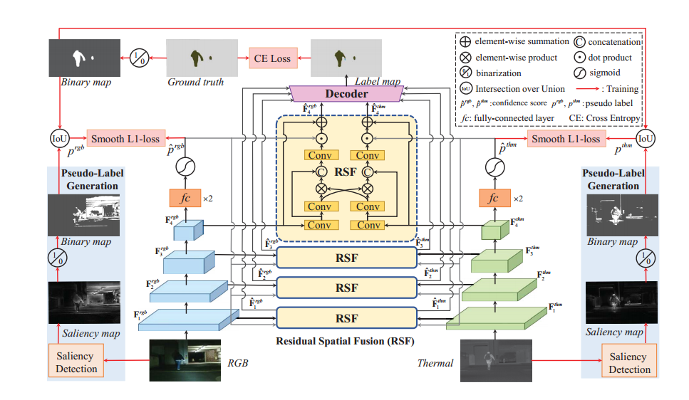

# RSFNet: Residual Spatial Fusion Network for RGB-Thermal Semantic Segmentation
This is official pytorch implementation of [RSFNet：Residual Spatial Fusion Network for RGB-Thermal Semantic Segmentation](https://arxiv.org/abs/2306.10364). The paper is available  [here](https://arxiv.org/pdf/2306.10364.pdf).
<br/>

## Introduction
<br/>This work proposes a Residual Spatial Fusion Network (RSFNet) for RGBT semantic segmentation. Specifically, we employ an asymmetric encoder to learn the compensating features of the RGB and the thermal images. To effectively fuse the dual-modality features,we generate the pseudo-labels by saliency detection to supervise the feature learning, and develop the Residual Spatial Fusion(RSF) module with structural re-parameterization to learn more promising features by spatially fusing the cross-modality features. RSF employs a hierarchical feature fusion to aggregate multilevel features, and applies the spatial weights with the residual connection to adaptively control the multi-spectral feature fusion by the confidence gate. Extensive experiments were carried out on two benchmarks, i.e.,  MFNet database and PST900 database. The results have shown the state-of-the-art segmentation performance of our method, which achieves a good balance between accuracy and speed.

## Install Dependencies
The code is written in Python 3.8 using the following libraries:

```
numpy
tqdm
opencv-contrib-python
torch==1.8.0
tensorboard==2.7.0
torchsummary==1.5.1 
torchvision==0.9.0
scikit-learn==1.0.1
```

Install the libraries using [requirements.txt](requirements.txt) as:

```
pip install -r requirements.txt
```

## Data
For training, download the MFNet dataset into the [datasets/MF](datasets/MF) directory. Follow the folder structure given below. To train the model on any other dataset, please modify the path to the input images and re-produec pseudo label for training in [pseudo_label_produce.py](pseudo_label_produce).

<br/>


## Folder Structure
While training, the models are saved in a folder specifying the hyper-parameters for that run under the [PolyWeightPath](PolyWeightPath) directory, including the .pth file and the .log file. The directory structure looks like this:
```
├── datasets
│   └── MF
│       ├── images
│       │   ├── 00001D.png
│       │   ├── 00002D.png
│       │   └── *.png
│       │
│       ├── labels
│       │   ├── 00001D.png
│       │   ├── 00002D.png
│       │   └── *.png
│       │
│       ├── seperated_images
│       │   ├── 00001D_rgb.png
│       │   ├── 00001D_th.png
│       │   └──*.png
│       │
│       ├── visual
│       │     ├── 00001D.jpg
│       │     ├── 00002D.jpg
│       │     └── *.jpg
│       │
│       ├── test_day.txt
│       ├── test_list.txt
│       ├── test_night.txt
│       ├── test.txt
│       ├── score.pkl
│       ├── train.txt
│       ├── val_test.txt
│       └── val.txt
│
├── model
│   ├── __init__.py
│   ├── DPAdd50_EGCFM_k5_addHead.py
│   └── unet10.py
│
├── modules
│   ├── aspp.py
│   ├── context_module.py
│   ├── dbb_transforms.py
│   ├── egcfm.py
│   └── Gate_module.py
│   
├── runs
│   └── DPAdd50_EGCFM_k5_addHead
│       └── 18
│                ├── model
│                │   └── *.pth
│                └── result         
│                       
├── util
│   └── util.py
│
│── utils
│   ├── calculate_weights.py
│   ├── dataset.py
│   ├── __init__.py
│   ├── mean_std.py
│   └── transform.py
│
├── PolyWeightPath
├── train_gate1_weight.py
├── train_gate1_weight.sh
├── my_demo.py
├── pseudo
├── pseudo_label_produce.py
├── README.md
└── for_gate1_weight.sh
```

<br/>

## Results
<table>
   <tr>
      <td>model</td>
      <td>Dataset</td>
      <td>mAcc</td>
      <td>mIOU</td>
   </tr>
   <tr>
      <td>RSFNet 50-18</td>
      <td>MFNet Dataset</td>
      <td>71.4</td>
      <td>54.0</td>
   </tr>
</table>

## Training & Testing
### produce pseudo label:
Producing pseudo-label and generated score.pkl file before training: 
```
python pseudo_label_produce.py
```

<br/>

### Training the RSFNet 50-18:
Use the command below for training, modify the run-time arguments (like hyper-parameters for training, path to save the models, etc.) as required:
```
bash for_gate1_weight.sh DPAdd50_EGCFM_k5_addHead 18 8 0.001 1.05 200 0 true 0.3 
```

<br/>

### Testing the RSFNet 50-18:
Before testing, place the trained model file in the [runs/DPAdd50_EGCFM_k5_addHead/18/model](runs/DPAdd50_EGCFM_k5_addHead/18/model) directory and use the command below for testing:
```
python my_demo.py
```
<br/>

## Citation

If you find this repo useful, please cite the following paper.

```
@article{li-rsfnet,
  author    = {Ping Li, Junjie Chen, Binbin Lin, Xianghua Xu},
  title     = {Residual Spatial Fusion Network for RGB-Thermal Semantic Segmentation},
  journal   = {arXiv},
  year      = {2023},
  doi       = {https://doi.org/10.48550/arXiv.2306.10364
}
```

## Contact

For any issues, please contact Mr. Chen Junjie via email cjj@hdu.edu.cn

## Acknowledgement
We would like to thank the authors of [MFnet](https://github.com/haqishen/MFNet-pytorch) and [ECANet](https://github.com/BangguWu/ECANet), which accelerated the development of our RSFNet code. 


